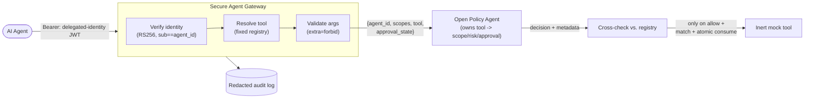

# Secure Agent Gateway

A security-engineering vertical slice demonstrating how AI agents can
invoke tools through **delegated identity, least-privilege authorization,
policy enforcement, approval controls, argument validation, and auditable
execution.**

This is not a chatbot and it does not embed an LLM. It is the enforcement
layer an LLM-driven agent would sit behind: the boundary that decides,
independent of anything the agent claims about itself, whether a
requested tool call is allowed to happen at all.

> **All tools in this repository are inert mocks.** `documents.read`
> returns fixed in-memory text. `tickets.create` returns a fabricated
> ticket record with a random id. `admin.rotate_key` never contacts a key
> management system and never rotates a real credential; it always
> returns a simulated result. No tool performs shell execution, network
> I/O, or file I/O. See [`src/gateway/tools_impl/`](src/gateway/tools_impl/).

## What this demonstrates

`POST /v1/tool-invocations` is the one endpoint in this slice, and every
request through it does all of the following, in order, failing closed at
every step:

1. Verify a signed delegated-identity JWT (RS256, algorithm allow-listed,
   no algorithm-confusion attack works against it).
2. Reject missing, expired, malformed, wrong-signature, or wrong-audience
   tokens.
3. Resolve the requested tool through a **fixed, server-side registry**,
   never a dynamic import, never client-named code.
4. Validate arguments against a **tool-specific Pydantic schema** that
   rejects unknown fields.
5. Non-consumingly validate any presented approval, then ask **Open
   Policy Agent** (which owns the tool → required-scope/risk/approval
   mapping itself, not the gateway) for a decision. The client cannot
   set or override the risk level; there is no field for it, and the
   gateway never even sends OPA a pre-resolved one.
6. Cross-check OPA's answer against the gateway's own fixed tool registry
   and fail closed on any disagreement, regardless of the decision.
7. Return `allow`, `deny`, or `approval-required`.
8. Execute only an inert mock tool, only on `allow`, and only after
   atomically re-confirming and consuming any required approval
   immediately beforehand.
9. Emit one or more **redacted, structured audit events** per request:
   hashes of arguments and results, never raw values, and never an
   approval id or credential.

Full request/decision flow: [docs/architecture.md](docs/architecture.md).
Full attacker-facing analysis: [docs/threat-model.md](docs/threat-model.md).

## Architecture (summary)



See [docs/architecture.md](docs/architecture.md) for the full sequence
diagram, trust-boundary breakdown, the two-phase approval flow, the
Docker network topology, and the specific mechanisms that prevent
risk-level override and JWT algorithm confusion.

## Local setup

Requires Python 3.11–3.13 and, for the full integration path, Docker
Compose.

```bash
python -m venv .venv
source .venv/bin/activate   # or .venv\Scripts\activate on Windows
pip install -e ".[dev]"
```

### Run the tests

```bash
pytest -v --cov=gateway --cov-report=term-missing
ruff check src tests
mypy src
bandit -r src -c pyproject.toml
```

### Run the Rego policy tests directly

```bash
docker run --rm -v "$(pwd)/policy:/policy" openpolicyagent/opa:0.70.0 test /policy -v
```

(Or install the [`opa` CLI](https://www.openpolicyagent.org/docs/latest/cli/)
locally and run `opa test policy/ -v`.)

### Run the full stack with Docker Compose

```bash
python scripts/generate_dev_keys.py   # writes ./devkeys/, gitignored, never committed
docker compose up -d --build
python scripts/smoke_test.py          # end-to-end check against the real gateway + real OPA
docker compose down
```

The gateway listens on `http://localhost:8088` (mapped from container port
8000: 8000 is a common local dev port, so compose remaps it to avoid
collisions; change the mapping in `docker-compose.yml` if you'd rather use
8000). OPA has no published port at all; it's reachable only from the
gateway container, over an isolated Docker network with no internet
egress; see [docs/architecture.md#docker-network-topology](docs/architecture.md#docker-network-topology)
for why, and `scripts/verify_opa_hardening.py` for how to still query it
directly for debugging.

### Manually exercise the API

```bash
python scripts/generate_dev_keys.py
docker compose up -d --build

TOKEN=$(python scripts/mint_demo_token.py --scope documents.read)

curl -s http://localhost:8088/v1/tool-invocations \
  -H "Authorization: Bearer $TOKEN" \
  -H "Content-Type: application/json" \
  -d '{"tool": "documents.read", "arguments": {"document_id": "doc-001"}}' | python -m json.tool
```

Try a high-risk tool without approval:

```bash
ADMIN_TOKEN=$(python scripts/mint_demo_token.py --scope admin.rotate_key)

curl -s http://localhost:8088/v1/tool-invocations \
  -H "Authorization: Bearer $ADMIN_TOKEN" \
  -H "Content-Type: application/json" \
  -d '{"tool": "admin.rotate_key", "arguments": {"key_id": "key-1", "reason": "rotate"}}' | python -m json.tool
# -> {"decision": "approval-required", ...}
```

Grant and use an approval:

```bash
# Note: there is no `granted_by` field; the approver identity recorded
# on the grant always comes from server-side APPROVER_IDENTITY, never
# from the request body (see docs/architecture.md#two-phase-approval-flow).
APPROVAL_ID=$(curl -s http://localhost:8088/v1/approvals \
  -H "X-Approver-Key: dev-only-approver-key-not-a-secret" \
  -H "Content-Type: application/json" \
  -d '{"tool": "admin.rotate_key", "arguments": {"key_id": "key-1", "reason": "rotate"}, "agent_id": "agent-demo-001", "delegated_user_id": "user-demo-001"}' \
  | python -c "import json,sys; print(json.load(sys.stdin)['approval_id'])")

curl -s http://localhost:8088/v1/tool-invocations \
  -H "Authorization: Bearer $ADMIN_TOKEN" \
  -H "Content-Type: application/json" \
  -d "{\"tool\": \"admin.rotate_key\", \"arguments\": {\"key_id\": \"key-1\", \"reason\": \"rotate\"}, \"approval_id\": \"$APPROVAL_ID\"}" | python -m json.tool
# -> {"decision": "allow", "result": {"status": "simulated_rotation_recorded", ...}}
```

## Reproduction: verifying the security claims

Every claim in the [threat model](docs/threat-model.md) has a
corresponding automated test. To reproduce the full validation:

```bash
pip install -e ".[dev]"
pytest -v                                            # 59 tests, includes every required scenario below
ruff check src tests scripts && mypy src && bandit -r src -c pyproject.toml
pip-audit                                             # dependency vulnerability scan
docker run --rm -v "$(pwd)/policy:/policy" openpolicyagent/opa:0.70.0 test /policy -v
docker run --rm -v "$(pwd)/policy:/policy" openpolicyagent/opa:0.70.0 check /policy

python scripts/generate_dev_keys.py
docker compose up -d --build
python scripts/smoke_test.py                          # host -> gateway, end-to-end
docker run --rm --network secure-agent-gateway_internal_net \
  -v "$(pwd)/scripts:/scripts:ro" --entrypoint python secure-agent-gateway-gateway \
  /scripts/verify_opa_hardening.py                    # internal_net -> opa directly
docker compose down
```

Required scenarios and where each is tested:

| Scenario | Test |
|---|---|
| Valid read request | `tests/test_tool_invocation.py::test_valid_read_request_allowed` |
| Missing token | `test_missing_token_rejected` (both files) |
| Expired token | `tests/test_token_verification.py::test_expired_token_rejected` |
| Wrong issuer | `::test_wrong_issuer_rejected` |
| Wrong audience | `::test_wrong_audience_rejected` |
| Invalid signature | `::test_invalid_signature_rejected` |
| Missing delegated scope | `tests/test_tool_invocation.py::test_missing_delegated_scope_denied` |
| Scope escalation attempt | `::test_scope_escalation_attempt_denied` |
| Unknown tool | `::test_unknown_tool_rejected` |
| Unexpected argument | `::test_unexpected_argument_rejected` |
| Client-supplied risk override | `::test_client_supplied_risk_override_rejected` |
| Policy-service failure | `::test_policy_service_failure_fails_closed` |
| Approval required | `tests/test_approvals.py::test_approval_required_when_none_supplied` |
| Approval replay | `::test_approval_replay_denied` |
| Approval for different arguments | `::test_approval_for_different_arguments_denied` |
| Approval for different identity | `::test_approval_for_different_identity_denied` |
| Audit redaction | `tests/test_audit.py::test_audit_redacts_raw_arguments` |
| Audit entry for denial | `::test_audit_entry_for_denial_is_distinguishable_from_allow` |
| Mock tool exception fails safely | `tests/test_tool_invocation.py::test_mock_tool_exception_fails_safely`, `::test_unexpected_tool_exception_fails_safely` |
| Compromised gateway can't weaken policy (spoofed scope/risk) | `policy/gateway/authz_test.rego::test_ignores_spoofed_required_scope_and_risk`, `tests/test_approvals.py::test_fake_policy_client_ignores_spoofed_scope_metadata`, `scripts/verify_opa_hardening.py` (live OPA) |
| Registry-policy metadata mismatch fails closed | `tests/test_tool_invocation.py::test_registry_policy_mismatch_fails_closed` |
| Approval survives a policy outage / a policy denial | `tests/test_approvals.py::test_approval_survives_policy_outage`, `::test_approval_survives_policy_denial` |
| Only one of two competing consumers wins a race | `::test_approval_race_only_one_consumer_wins`, `::test_consume_race_lost_denies_at_api_level` |
| Approval expiring between validation and consumption | `::test_approval_expiring_between_validate_and_consume_fails_closed` |
| `sub`/`agent_id` mismatch rejected | `tests/test_token_verification.py::test_sub_agent_id_mismatch_rejected` |
| Unsupported JWT algorithm rejected at startup | `tests/test_config.py::test_load_settings_rejects_unsupported_jwt_algorithm` |
| Client-supplied `granted_by` rejected | `tests/test_approvals.py::test_create_approval_ignores_client_supplied_granted_by` |
| Approval lifecycle audited (created / rejected / consumed / binding failure) | `tests/test_audit.py::test_approval_creation_audited_and_redacted`, `::test_approval_rejection_audited`, `::test_approval_consumption_audited`, `::test_approval_replay_binding_failure_audited` |
| OPA management API rejects policy mutation | `policy/system/authz_test.rego`, `scripts/verify_opa_hardening.py` (live OPA) |

Plus algorithm-confusion coverage
(`test_algorithm_confusion_none_rejected`,
`test_algorithm_confusion_hs256_with_public_key_rejected`), fail-closed
configuration loading (`tests/test_config.py`), and approver-credential
enforcement on `POST /v1/approvals` (`tests/test_approvals.py`).

## Project layout

```
src/gateway/
  identity/     JWT verification -> AgentIdentity (RS256-only, sub==agent_id)
  registry/     fixed tool registry + per-tool argument schemas
  risk.py       risk-level enum (values resolved by OPA, not this file)
  policy/       OPA HTTP client (fail-closed on any error or schema mismatch)
  approvals/    single-use approval record store (validate, then atomic consume)
  audit/        redacted structured audit events (tool invocations + approvals)
  tools_impl/   inert mock tool handlers
  api/          FastAPI routes, dependencies, request/response schemas
policy/gateway/  Rego authorization policy (owns tool -> scope/risk/approval) + opa test suite
policy/system/   OPA's own read-only management-API policy + opa test suite
tests/           pytest suite (unit + API-level)
scripts/         dev-only key generation, token minting, smoke test, OPA hardening verification
docs/            architecture, threat model
```

## Security assumptions and known limitations

Summarized in [docs/threat-model.md](docs/threat-model.md#security-assumptions)
and [docs/threat-model.md](docs/threat-model.md#known-limitations). In short: the approval store
is in-memory and single-process (not production-durable), the approver
credential is a static placeholder (not a real approver identity system),
there's no rate limiting, the gateway/OPA channel isn't mutually
authenticated or encrypted, and the gateway container (unlike OPA) is not
network-egress-blocked because its port needs to be published to the
host. None of these affect the correctness of the controls this slice
claims; they're scope boundaries for what a second slice would add.

## Roadmap

Beyond this vertical slice:

- **Sandboxed workers**: execute real (non-mock) tools in an isolated
  runtime (gVisor/Firecracker-class isolation or an out-of-process worker
  with a locked-down syscall surface) rather than in-process.
- **Untrusted tool output**: treat a tool's *return value* as
  attacker-influenced input once real, non-inert tools exist (e.g. a
  document-fetch tool returning content from an external source), with
  output scanning/sanitization before it reaches an agent or LLM.
- **Workload identity**: replace the static approver credential and the
  Gateway↔OPA network-trust assumption with SPIFFE/SPIRE-style workload
  identity and mutual TLS.
- **Adversarial evaluations**: a red-team harness that scripts prompt-
  injection-style and policy-bypass attempts against a live gateway (not
  just unit tests of individual controls) and tracks pass/fail over time.
