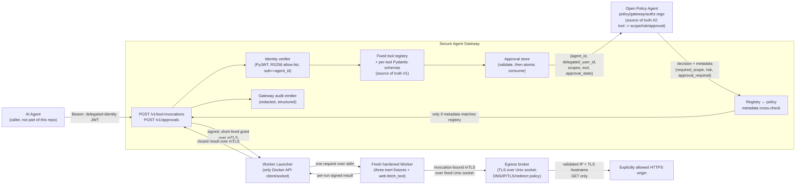
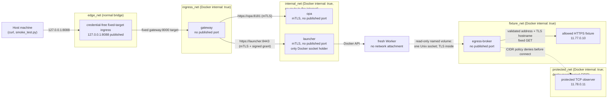

# Architecture

## Components



- **Agent**: out of scope for this repo. Any HTTP caller presenting a
  valid delegated-identity token.
- **Identity verifier**: cryptographic and claim verification only. Never
  trusts unverified claims, and requires the JWT `sub` claim to equal
  `agent_id` (see [Identity model](#identity-model) below and
  `src/gateway/identity/tokens.py`).
- **Fixed tool registry**: the only place a tool name resolves to a
  schema, risk, scope, and artifact digest. A corresponding closed registry
  inside the Worker resolves the inert handler. No dynamic import and no
  `getattr` on client input
  (`src/gateway/registry/tools.py`). This is one of *two* independent
  sources of truth for what a tool costs; see
  [Who owns the policy mapping](#who-owns-the-policy-mapping) below.
- **Approval store**: single-use records bound to (tool, argument hash,
  agent identity, delegated-user identity, expiration), with a
  non-consuming `validate()` and a separately-called atomic `consume()`
  (`src/gateway/approvals/store.py`); see
  [Two-phase approval flow](#two-phase-approval-flow).
- **OPA**: the *only* component that renders allow/deny/approval-required,
  and the *only* place the tool -> required-scope/risk/approval-required
  mapping is decided from (the gateway sends a tool name, never a
  pre-resolved scope or risk). The gateway treats any failure to reach it,
  or any response that fails its closed schema, as a deny
  (`src/gateway/policy/opa_client.py`, `policy/gateway/authz.rego`).
- **Registry ↔ policy metadata cross-check**: after OPA answers, the
  gateway compares OPA's `required_scope`/`risk`/`approval_required`
  metadata against its own registry entry for the same tool and fails
  closed on any mismatch, regardless of what `decision` says. See
  [Why a compromised gateway can't weaken policy](#why-a-compromised-gateway-cant-weaken-policy).
- **Worker Launcher**: the only service with the Docker SDK and socket. Its
  one-field request accepts an `ExecutionGrant`, not runtime options; its own
  registry selects an image that is resolved once to an immutable Docker image
  ID and a fixed entry point.
- **Disposable Worker**: one non-root, read-only, network-disabled container
  per accepted grant. It receives one bounded stdin record, re-verifies the
  grant, executes one registered tool, signs the result with a per-run key,
  and exits. It has no Docker SDK or socket. A `web.fetch_text` invocation gets
  one read-only mount containing only the broker's Unix socket; it still has no
  Docker network attachment.
- **Egress broker**: the only component that resolves names or opens external
  sockets for a Worker. It verifies an invocation-bound Worker certificate and
  the signed grant, authorizes the canonical origin, validates every DNS answer
  against both universal address classes and deployment-specific denied CIDRs
  immediately before connecting, connects to the validated address while
  preserving TLS hostname verification, and repeats the complete decision for
  every redirect. It emits one redacted decision record for every attempted hop.
- **Tools**: three existing pure inert fixtures plus `web.fetch_text`, whose only
  network-capable operation is the closed broker request. The Worker never
  receives an HTTP method, header, cookie, credential, proxy, socket address,
  or runtime-network option from the caller.
- **Audit emitters**: two closed Pydantic schemas (`AuditEvent` for the
  tool-invocation lifecycle, `ApprovalAuditEvent` for the approval
  lifecycle) that structurally cannot carry raw arguments, tokens,
  approval ids, or approver credentials; only hashes and enum-like
  status fields (`src/gateway/audit/log.py`). Separate redacted Launcher and
  Worker lifecycle schemas record accepted/start/terminal provenance without
  arguments, credentials, grants, nonces, or raw results
  (`src/gateway/execution/audit.py`).

## Development credential distribution

Compose mounts individual credential files rather than the `devkeys` directory.
The Gateway alone receives the execution-grant private key; the Launcher alone
receives the Worker client-CA private key; OPA receives only its server identity
and Gateway-client CA certificate; and the broker receives its server identity,
the Worker CA certificate, the grant public key, and its upstream trust root.
The allowed and protected fixtures have separate server identities. The
credential-free ingress receives no key mount. Evaluation containers likewise
receive only the public or private files required for the specific test case;
negative credential tests document why they need a signing or CA private key.

## Identity model

The JWT subject (`sub`) is defined, for this project, to be the same
value as the `agent_id` claim: the token authenticates the *agent*, and
`delegated_user` is a separate, asserted (not cryptographically verified)
claim naming the human the agent is acting for. `verify_delegated_token`
requires `sub == agent_id` and rejects the token outright if they differ.
See the full writeup in `src/gateway/identity/tokens.py`'s module
docstring, and `TokenSubjectMismatch` /
`tests/test_token_verification.py::test_sub_agent_id_mismatch_rejected`.

RS256 is the only algorithm this gateway will ever accept, not just by
default, but enforced: `load_settings()` rejects `JWT_ALGORITHM=HS256`,
`none`, or any value other than `RS256` at startup, before the process
serves any traffic (`src/gateway/config.py::SUPPORTED_JWT_ALGORITHMS`,
`tests/test_config.py::test_load_settings_rejects_unsupported_jwt_algorithm`).

## Who owns the policy mapping

`policy/gateway/authz.rego` defines a `tools` object (the tool name ->
(`required_scope`, `risk`, `approval_required`) mapping) as OPA's own
data. The gateway never sends a pre-resolved `required_scope` or `risk`
in its policy input; it sends only verified identity, the requested tool
*name*, and an approval state. A compromised or buggy gateway that tried
to send those fields anyway would have them ignored entirely, because
nothing in the Rego decision logic reads them. This is proven, not just
asserted, at three levels:

1. `policy/gateway/authz_test.rego::test_ignores_spoofed_required_scope_and_risk`:
   a Rego unit test.
2. `tests/test_approvals.py::test_fake_policy_client_ignores_spoofed_scope_metadata`:
   a Python-level test of the policy-client contract.
3. `scripts/verify_opa_hardening.py`: a live-OPA integration check run
   against the real, running Docker Compose stack.

## Request sequence: `POST /v1/tool-invocations`

```mermaid
sequenceDiagram
    participant Agent
    participant Gateway
    participant Approvals as Approval Store
    participant OPA
    participant Launcher as Worker Launcher
    participant Worker as Disposable Worker
    participant Egress as Egress Broker

    Agent->>Gateway: POST /v1/tool-invocations<br/>Authorization: Bearer <JWT><br/>{tool, arguments, approval_id?}
    Gateway->>Gateway: Verify signature, iss, aud, exp, sub==agent_id, claims<br/>(RS256-only allow-list, no alg confusion)
    alt token invalid
        Gateway-->>Agent: 401 (generic, no oracle)
    end
    Gateway->>Gateway: Resolve tool from fixed registry
    alt unknown tool
        Gateway-->>Agent: 404 unknown_tool
    end
    Gateway->>Gateway: Validate arguments (extra="forbid")
    alt bad/extra arguments
        Gateway-->>Agent: 422 invalid_arguments
    end
    Gateway->>Approvals: validate(approval_id, ...): non-consuming
    Approvals-->>Gateway: valid | invalid (never mutates the record)
    Gateway->>OPA: POST /v1/data/gateway/authz/result<br/>{agent_id, delegated_user_id, scopes, tool, approval_state}
    alt OPA unreachable / response fails closed schema
        Gateway-->>Agent: 503 policy_unavailable (approval untouched)
    end
    OPA-->>Gateway: decision + required_scope + risk + approval_required
    Gateway->>Gateway: Cross-check metadata against fixed registry
    alt metadata disagrees with registry
        Gateway-->>Agent: 503 policy_registry_mismatch (approval untouched)
    end
    alt deny
        Gateway-->>Agent: 200 {decision: "deny"} (approval untouched)
    else approval-required
        Gateway-->>Agent: 200 {decision: "approval-required"} (approval untouched)
    else allow, tool requires approval
        Gateway->>Approvals: consume(approval_id, ...): atomic final check
        alt consume fails (race lost / expired since validate)
            Gateway-->>Agent: 200 {decision: "deny"} (approval finalization failed)
        end
    end
    opt allow, and (no approval needed OR consume succeeded)
        Gateway->>Gateway: Build ActionEnvelope and sign short-lived ExecutionGrant
        Gateway->>Launcher: POST /v1/executions over mTLS<br/>{grant only; no runtime controls}
        Launcher->>Launcher: Verify signature, claims, bindings, and nonce;<br/>atomically claim nonce
        Launcher->>Worker: Create fresh hardened container by immutable image ID;<br/>deliver one bounded stdin record
        Worker->>Worker: Re-verify grant and execute fixed-registry tool
        opt web.fetch_text
            Launcher->>Worker: Add fixed read-only broker socket + fresh<br/>invocation/Worker-bound client certificate
            Worker->>Egress: TLS over Unix socket: {worker_id, signed grant}<br/>(URL exists only in the signed action)
            Egress->>Egress: Verify certificate role/invocation, grant, limits,<br/>canonical origin, all connect-time DNS answers
            Egress->>Egress: Connect to validated IP; verify TLS for original hostname;<br/>send fixed GET without cookies/auth
            loop each redirect, maximum 3
                Egress->>Egress: Canonicalize, authorize, resolve, and validate again
            end
            Egress-->>Worker: Closed bounded UTF-8 result + per-hop decision chain
        end
        Worker-->>Launcher: Per-run signed ToolResultEnvelope
        Launcher->>Launcher: Verify invocation/nonce/worker/tool/artifact binding; destroy Worker
        alt Launcher, Worker, protocol, or cleanup fails
            Gateway-->>Agent: 502 tool_execution_failed (generic)
        end
        Launcher-->>Gateway: authenticated closed result
        Gateway-->>Agent: 200 {decision: "allow", result}
    end
    Gateway->>Gateway: Emit redacted audit event(s) (always, every branch)
```

## Controlled egress protocol

`web.fetch_text` accepts exactly one argument, `url`. Validation converts it
to one canonical HTTPS form before the argument digest and `ActionEnvelope`
are created. The signed `ExecutionGrant.egress` authority contains the same
initial URL, the server-configured origin set, the two permitted media types
(`text/plain` and `text/html`), a three-hop redirect ceiling, a 64 KiB body
ceiling, and a five-second deadline. The broker also has its own fixed copy of
those policy ceilings and refuses a grant that is broader. There is no broker
field for a method, arbitrary URL, headers, cookies, credentials, proxy,
address, or transport option.

The Launcher issues a new client certificate for each accepted web invocation.
Its only URI SAN is
`spiffe://secure-agent-gateway/worker/{invocation_id}/{worker_id}`. The broker's
TLS stack requires the dedicated Worker client CA; application-layer validation
then requires that exact SAN to match both the signed action and broker request.
The broker also verifies grant signature, issuer, audience, expiry, tool,
artifact, argument digest, approval binding, egress operation, origin subset,
and limits before DNS. A nonce is accepted once per broker process.

For each hop the broker:

1. rejects controls, whitespace, backslashes, fragments, user-info, non-HTTPS
   schemes, non-443 ports, malformed percent escapes, alternate numeric hosts,
   and invalid IDNA; lowercases and IDNA-encodes the host, removes DNS-equivalent
   trailing dots, and normalizes percent-escape case;
2. requires the canonical origin in both the signed grant and broker policy;
3. resolves once at connection time and rejects the entire answer set if any
   address is loopback, private, link-local, multicast, unspecified, reserved,
   non-global, or a known metadata address (including IPv4-mapped IPv6);
4. connects directly to one validated address without a second name lookup,
   then verifies TLS for the original canonical hostname; and
5. sends a fixed HTTP/1.1 `GET` with `Accept-Encoding: identity`, no cookie or
   authorization state, and bounded deadline/body processing.

Redirect responses do not inherit the prior decision. Their `Location` is
resolved against the current URL and starts the same five-step process as a new
hop. The broker records only a destination hash, allowed origin, hashed
resolved addresses, decision/reason, and DNS/broker duration—never response
content, grants, certificates, keys, cookies, or credentials.

## Response shape

All three policy outcomes (`allow`, `deny`, `approval-required`) return
`200 OK` with a `decision` field: the gateway successfully rendered a
decision in each case. HTTP error codes are reserved for requests the
gateway could not evaluate at all or could not trust the answer to:
`401` (bad token), `404` (unknown tool), `422` (schema validation
failure, including a rejected client-supplied `risk` field), `502`
(isolated-execution failure), `503` (policy engine unreachable, or the
policy's metadata disagreed with the registry).

## Two-phase approval flow

`admin.rotate_key` requires approval. A separate, distinctly-authenticated
endpoint (`POST /v1/approvals`, gated by a static approver credential
standing in for a real approver identity system; see
[Known limitations](threat-model.md#known-limitations)) creates a record
binding a tool name, an argument hash, and an identity pair to a
single-use, time-limited token. The approver identity recorded on that
grant (`granted_by`) is derived from trusted server configuration
(`APPROVER_IDENTITY`), never from client input: the request schema has
no `granted_by` field at all.

Consuming that approval is a **two-phase** operation, specifically to
avoid burning it on anything other than a genuine execution:

1. **Validate** (non-consuming): the gateway checks the approval's
   binding (tool, argument hash, agent identity, delegated-user
   identity, expiration) without marking it used. This produces the
   `approval_state` ("valid" / "invalid" / "none") sent to OPA.
2. **Decide**: OPA is asked for a decision. A policy denial, an
   approval-required response, a policy-engine outage, or a
   registry/policy metadata mismatch all leave the approval exactly as
   valid as it was before the request started.
3. **Consume** (atomic): only when OPA answers `allow` for a tool that
   requires approval does the gateway call the *same* record's `consume()`,
   a single lock-guarded check-and-mark-used operation. Only then does
   execution happen.

This is what prevents "premature consumption": in a naive single-phase
design, an approval consumed at policy-input-preparation time would be
stranded as spent by a subsequent denial or outage, even though nothing
was ever executed. It's also what makes a race between two callers
presenting the same approval safe: both can validate as "the approval
looks fine", but only one can win the atomic consume.
See `src/gateway/approvals/store.py` and the regression tests in
`tests/test_approvals.py` (`test_approval_survives_policy_outage`,
`test_approval_survives_policy_denial`,
`test_approval_race_only_one_consumer_wins`,
`test_approval_expiring_between_validate_and_consume_fails_closed`).

Presenting an invalid approval (wrong id, already used, wrong arguments,
wrong identity, expired) is treated as an outright deny, not a second
invitation to retry, and is recorded in the audit trail with a distinct
`approval_state`. The audit trail never records the approval id itself,
the approver credential, or raw arguments; only tool name, identity,
argument hash, and an event/reason (see `ApprovalAuditEvent` in
`src/gateway/audit/log.py`).

## Why the risk level can't be forged

`ToolInvocationRequest` (`src/gateway/api/schemas.py`) has no `risk`
field and `extra="forbid"`. Risk is never client input, and, as of the
OPA-owns-the-mapping correction, it isn't gateway-computed-and-sent
either: OPA resolves it from its own `tools` data given only the tool
name, and the gateway cross-checks that resolved value against its own
registry before trusting anything about the decision.

## Why a compromised gateway can't weaken policy

Two independent components each hold their own copy of the tool -> scope/
risk/approval-required mapping: the Python `TOOL_REGISTRY`
(`src/gateway/registry/tools.py`) and OPA's `tools` data
(`policy/gateway/authz.rego`). The gateway never sends its copy to OPA;
it sends only the tool *name*, so a bug or compromise in the gateway
that caused it to construct a wrong policy input still can't make OPA
resolve the wrong scope or risk, because OPA was never told one; it
looks it up itself. The gateway then cross-checks OPA's answer against
its own copy and fails closed on any disagreement, which catches the
*other* direction of drift (OPA's data going stale relative to the
registry). See [Who owns the policy mapping](#who-owns-the-policy-mapping)
for how this is proven, not just designed.

## Why algorithm confusion can't work

`verify_delegated_token` calls `jwt.decode(..., algorithms=[algorithm])`
with a single-element allow-list, and `algorithm` can only ever be
`"RS256"`, because `load_settings()` rejects any other value at startup
(see [Identity model](#identity-model)). PyJWT only ever attempts
verification using an algorithm drawn from that list; it never lets the
token's own `alg` header pick the verification method. Neither `none` nor
`HS256` is ever in the allow-list, so neither a signature-less token nor
an HS256-with-public-key-as-secret forgery can verify. See
`tests/test_token_verification.py::test_algorithm_confusion_none_rejected`
and `::test_algorithm_confusion_hs256_with_public_key_rejected`.

## Docker network topology



`internal_net` is a Docker Compose network with `internal: true`: Docker
gives it no route to the outside world, which was verified empirically
(not assumed): a container attached only to it cannot resolve DNS or
open any outbound connection (see `docs/threat-model.md`'s security
assumptions for how this was checked). Both `gateway` and `opa` sit on
it, and it carries the mutually authenticated Gateway-to-OPA and
Gateway-to-Launcher control channels. Disposable Workers are attached to no
Docker network at all.

The egress broker is not attached to `internal_net` and exposes no TCP port to
the Worker. In the reproducible Compose evaluation it is attached to
`fixture_net`, where the allowlisted deterministic HTTPS fixture has a fixed
globally classified test address, and `protected_net`, whose entire subnet is
in the broker's server-owned deployment-denied CIDR set. An otherwise
allowlisted hostname resolves on `protected_net` to prove DNS occurs but the
connector does not run. The Worker is still created with
`network_disabled=True`; Docker attaches only the server-owned named volume at
`/run/secure-agent-egress` in read-only mode. Possessing the socket path is not
enough: the TLS handshake requires a fresh invocation-bound Worker credential,
and the signed grant supplies the only permitted destination and operation.

`opa` is attached to **only** `internal_net` and has no published port at
all. This was a deliberate choice after finding, empirically, that Docker
Compose does not honor a service's `ports:` mapping when its only network
is `internal: true`: publishing a port relies on the same NAT
infrastructure that `internal: true` disables. Rather than weaken OPA's
isolation to get a published port, OPA simply gets none: a stronger
guarantee than "published but loopback-only" would have been, at the cost
of OPA not being directly reachable from the host (see
`scripts/verify_opa_hardening.py` for how it's still tested, from a
container joined to the same internal network).

`gateway` is attached only to the internal control and ingress networks. A
direct published-port experiment on Docker Desktop timed out when the service
had only an `internal: true` network, so Compose uses a small credential-free
ingress on `edge_net`. That process has one compiled-in upstream,
`gateway:8000`, shares only `ingress_net` with the Gateway, and has no key,
token, Docker socket, or control-plane network. Host ingress therefore remains
available while the Gateway itself has no Internet, host-gateway, fixture, or
protected-network route.

OPA's own HTTPS API requires a client certificate signed by the development
Gateway-client CA. Its `--authorization=basic` policy in
`policy/system/authz.rego` checks the Gateway SPIFFE URI and allows only the decision
query and a liveness check; every other request, including attempts to
upload/replace/delete a policy via `PUT`/`DELETE /v1/policies/*` or to
read `/v1/data`, gets a `401`. This was verified against a real running
OPA server (not inferred from documentation); see
`policy/system/authz_test.rego` and `scripts/verify_opa_hardening.py`.
