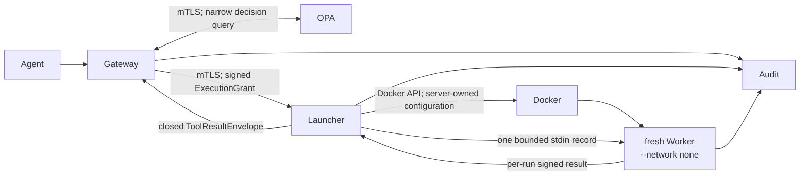

# Milestone 1 implementation: isolated execution

## Status and scope

This checkpoint implements the roadmap's isolated-worker protocol for the
three existing inert fixtures. It does not add a real tool, external network
access, secrets, an LLM, an agent adapter, or a new approval interface. It is a
research prototype, not a production-ready sandbox or a guarantee of security.

## Implemented path

`ActionEnvelope`, `ExecutionGrant`, `ToolResultEnvelope`, `LauncherRequest`,
and `WorkerRequest` are versioned Pydantic models with unknown fields
forbidden. Canonical JSON uses sorted keys, compact separators, UTF-8, and
rejects non-finite numbers. SHA-256 commitments bind validated arguments,
actions, approval state, artifacts, and results.

The Gateway signs an RSA/SHA-256 grant with a dedicated development workload
key. The Launcher and Worker independently verify protocol version, signature,
issuer, audience, issue and expiry times, maximum lifetime, action digest,
tool identity, artifact digest, argument digest, and approval digest. A
process-local atomic nonce guard permits one accepted execution. A fresh
per-run RSA key authenticates the result to its invocation, grant nonce,
Worker ID, tool, and artifact.

The Launcher's API accepts only `{grant}`. Image, entry point, mounts,
capabilities, networks, host paths, privileged mode, and runtime flags are not
fields callers can supply. The server registry maps all three fixture tools to
one artifact digest and one configured image reference. On first use, the
Launcher checks the image's artifact label and resolves the reference to an
immutable Docker image ID, which it caches for subsequent runs.

Each invocation creates a container with no network, UID/GID 10001, a
read-only root filesystem, a bounded `/tmp` tmpfs, all capabilities dropped,
`no-new-privileges`, Docker's default seccomp profile, memory/CPU/PID limits,
a bounded local log, a five-second deadline, and no mounts, devices, host
paths, or control sockets. The Launcher sends one bounded newline-delimited
request over Docker's hijacked stdin stream. The Worker processes exactly that
first record and exits; it does not wait for stream EOF. The Launcher verifies
the signed result and force-removes the container and anonymous state in a
`finally` block.

Only the Launcher image installs the Docker SDK, and only the Launcher service
mounts `/var/run/docker.sock`. Live checks confirm the Gateway and Worker have
neither the SDK nor the socket. The socket gives the Launcher high-value,
host-equivalent orchestration power; API narrowing reduces what callers can ask
it to do but does not make Launcher compromise safe.

## Internal authentication

The development key generator creates separate client and server CAs, a
Gateway client certificate, Launcher and OPA server certificates, and the
execution-grant keypair under gitignored `devkeys/`. Gateway-to-OPA and
Gateway-to-Launcher require TLS 1.2 or later, server-name verification, and
mutual certificate authentication. OPA additionally authorizes the exact
Gateway SPIFFE URI from the presented client certificate. The Launcher's
dedicated client trust root issues only the Gateway credential in this
prototype; the signed grant supplies an independent application-layer Gateway
authentication check.

This hand-generated PKI has no automated enrollment, rotation, revocation,
hardware protection, multi-host identity, or production CA operations. It is
only a repeatable local fixture.

## Audit behavior

The existing Gateway event remains API-compatible. Launcher events record
accepted, Worker-started, and terminal states. Worker events record one signed
terminal result. Events include request/correlation/invocation IDs, a nonce
hash, tool and artifact identity, Worker/image identity, result digest, and
outcome. Their closed schemas have no raw arguments, raw results, grants,
credentials, approval IDs, private nonces, or key material. An accepted
Launcher invocation emits one terminal Launcher outcome even when creation,
execution, verification, timeout, or cleanup fails.

## Tests and measured checkpoint

The automated suite pairs legitimate and malicious/control cases for closed
schemas, deterministic hashing, forged/expired/wrong-audience/unknown-version
grants, changed arguments and artifacts, replay and concurrent nonce use,
caller-selected runtime options, unregistered artifacts, wrong-invocation
results, resource/timeout/output failures, certificate absence/expiry/CA/role,
socket placement, cleanup, and fail-closed Gateway behavior. The legitimate
control is `documents.read`, preserving its existing response through
Gateway → OPA → Launcher → a fresh Worker.

On 2026-08-27, the local Windows/Docker Desktop evaluation used Docker Engine
29.7.2 and Python 3.13. It produced:

- 90 passing Python tests and 86% aggregate statement coverage;
- all nine live smoke checks passing through real OPA, Launcher, and disposable
  Docker Workers;
- all 28 OPA policy tests passing;
- all six live OPA API-hardening checks passing;
- all eight live Worker hardening/cleanup checks passing;
- all six internal mTLS checks passing, including missing-client-certificate and
  wrong-service-certificate connections denied by both OPA and Launcher;
- 20 legitimate `documents.read` runs with end-to-end p50 791.285 ms, p95
  1009.691 ms, minimum 712.553 ms, and maximum 2846.482 ms. The maximum includes
  a cold first sample; all raw samples were printed by
  `scripts/measure_milestone1.py`.

These are single-machine observations, not general performance or security
claims. CI and a final local validation may change the test count or coverage;
the command output is the authoritative result for a specific run.

## Residual limitations

- Docker shares the host kernel and is not equivalent to gVisor or a microVM.
  The prototype uses Docker's default seccomp policy, not a Worker-specific
  experimentally minimized syscall profile.
- The Launcher has the Docker socket. A Launcher or Docker daemon compromise
  can plausibly compromise the host. A production design needs a stronger
  brokered/rootless/dedicated-host or microVM control plane.
- Replay state, approval state, and audit output are process-local. Restarting
  the Launcher forgets claimed nonces, although short grant expiry limits the
  replay window. Durable distributed replay protection is not implemented.
- Image admission validates a locally built image label and pins its Docker
  image ID for the Launcher process lifetime. Supply-chain signatures,
  transparency, remote registry digest policy, and rebuild provenance are not
  implemented.
- The per-run result private key is delivered to the Worker in the same
  one-use request. It authenticates which launched invocation produced a
  result; it cannot make a compromised Worker truthful about its own result.
- Container log storage is bounded separately from the accepted result size;
  the limits reduce resource exposure but do not establish a formal
  denial-of-service bound for Docker or the host.
- The three tools remain inert fixtures. Milestone 1 does not address real
  egress, secret delivery, or untrusted external tool output.
