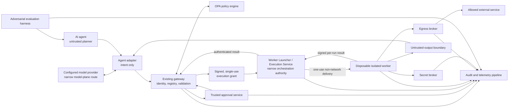

# Secure Agent Platform Research Roadmap

## Status and scope

This document is a research and engineering roadmap, not an implementation
specification or a claim of production readiness. It extends the repository's
current security-engineering vertical slice into an experimentally testable
platform for tool-using AI agents.

The current repository already provides a useful control-plane core:

- delegated agent identity verified from RS256 JWTs;
- a fixed server-side tool registry and strict per-tool argument schemas;
- OPA decisions with fail-closed response validation and an independent
  registry/policy metadata cross-check;
- time-limited, identity- and argument-bound, single-use approvals; and
- structured audit events containing hashes rather than raw arguments or
  results.

Those properties are exercised by the Python and Rego tests described in the
[README](../README.md), [architecture](architecture.md), and
[threat model](threat-model.md). The current tool handlers are deliberately
inert mocks executed in the gateway process. There is no agent adapter, real
tool isolation, controlled web egress, secret delivery system, trusted human
approval UI, hostile-output boundary, or end-to-end agent evaluation harness.
The approval store is process-local, the approver credential is a development
shared secret, the Gateway-to-OPA channel lacks workload identity and TLS, and
the gateway container retains general egress. These are starting conditions,
not solved problems.

## Central research question

**How can tool-using AI agents operate usefully without directly possessing
unrestricted tools, credentials, network access, or execution authority?**

The working hypothesis is that an agent can remain an untrusted intent
producer while a separate, consent-bound control and execution environment
authenticates identity, validates intent, applies policy, obtains human consent
when required, supplies narrowly scoped capabilities, executes in isolation,
and records the result. The empirical question is not merely whether attacks
are blocked, but whether this separation preserves enough legitimate-task
utility at acceptable denial, approval, and latency costs.

## Intended contribution

The intended contribution is a **consent-bound control and execution
environment for AI agents**. It should make authorization and execution
properties enforceable outside the model, instead of depending on a prompt or
on the agent accurately describing its own actions.

The contribution has three parts:

1. A reference architecture that separates agent planning from policy,
   consent, secrets, network mediation, and execution.
2. Concrete protocols and invariants that bind a decision to the exact action
   executed and make failures deny by default.
3. A reproducible adversarial evaluation measuring both security and utility.

The goal is evidence about a design, not guaranteed security. Isolation
engines, policy code, brokers, user interfaces, dependencies, and deployment
configuration can all contain defects. Results will be scoped to the tested
threat model, platform, tool set, and corpus.

## Non-goals

This project will not build a general agent framework, model-training platform,
model provider, arbitrary plugin marketplace, production orchestrator,
universal prompt-injection detector, or formal proof of security. It will not
attempt to replace existing agent runtimes or models. It will integrate with
configured agents and model providers while controlling the external authority
through which they reach tools, credentials, data-plane networks, and execution
workers.

The research prototype may define narrow adapters and deployment fixtures
needed to evaluate its security boundary. Those conveniences must not expand
into general orchestration or imply that the prototype supplies a production
identity, secrets, scheduling, or model-serving platform.

## Threat model and trust allocation

Treat the agent, its prompts, retrieved content, tool arguments before
validation, and all tool output as untrusted. Assume an attacker can induce
arbitrary agent requests, craft URLs and redirect chains, place prompt
injections in fetched content, replay messages, race approvals, trigger
timeouts, and cause dependencies to fail. Evaluate compromised-tool and
compromised-worker behavior within the isolation boundary.

Trust is intentionally narrower than “everything in the application.” The
gateway, OPA policy bundle, approval service, Worker Launcher / Execution
Service, egress and secret brokers, audit collector, and the isolation substrate
form the trusted computing base for the corresponding claims. The Launcher is
a particularly high-value trust assumption because it alone holds narrow
container-orchestration access. Registry maintainers, policy publishers,
approvers, identity and secret backends, the host kernel or hypervisor, and the
build/release process remain trust assumptions. A fully compromised host,
Launcher, malicious policy publisher, stolen approver session, or vulnerable
isolation substrate is not solved by this architecture.

Initial research deployments should keep tools read-only and use synthetic or
purpose-built data. Destructive tools and valuable production credentials are
out of scope until the preceding controls have independent review and evidence.

## Security invariants

The following are target invariants. Each must have executable negative tests,
not only documentation.

1. **Registry confinement.** Agents cannot execute tools outside a fixed,
   versioned server-side registry. An agent-provided name never becomes a
   module, executable, image, entry point, or dynamic dispatch target. A worker
   accepts only an authorized tool identifier and artifact digest that match
   the registry snapshot in its execution grant.
2. **Credential non-possession.** Agents cannot directly access credentials.
   Requests may contain opaque secret references, but never secret values.
   Only the secret broker resolves an authorized reference and delivers a
   short-lived, least-privilege value to the designated worker through a
   non-agent-visible channel. Secret values are excluded from arguments,
   outputs, errors, telemetry, and persistent worker state.
3. **Independent destination validation.** The egress broker canonicalizes and
   authorizes the scheme, hostname, port, method, and resolved addresses before
   every connection. Every redirect is treated as a new destination and is
   independently resolved and validated; redirect inheritance is forbidden.
   Loopback, link-local, private, multicast, metadata-service, unsupported
   scheme, and policy-disallowed destinations are denied for both IPv4 and
   IPv6. DNS answers are validated at connect time to limit rebinding and the
   connection is made to a validated address without changing TLS hostname
   verification.
4. **Fail-closed policy.** Policy timeout, unavailability, invalid response,
   version mismatch, indeterminate result, missing input, or registry/policy
   disagreement denies execution. No cached allow decision survives beyond its
   explicitly defined identity, action, policy version, and expiration.
5. **Exact consent binding.** Human approval is bound to the authenticated
   requesting agent, delegated human, authenticated approver, registry and
   policy versions, tool identifier and artifact digest, canonical validated
   arguments, canonical destination (or an explicit absence of one), risk
   presentation, expiration, and a single-use nonce. For an approved network
   action, a redirect outside the approved destination is a different action
   and is denied or requires new approval.
6. **Trusted approval rendering.** The approval service—not the agent—renders
   the action description, identity, tool, validated arguments, destination,
   risk, and expiration from the canonical server-side approval envelope. The
   agent may supply data values, but cannot supply labels, summaries, hidden
   fields, severity, or the final consent text.
7. **Mutation invalidates consent.** Approval is over a canonical envelope
   digest. Any post-approval change to a bound field, including normalization
   differences, tool or image version, argument, identity, destination, risk,
   policy version, expiry, or secret reference, produces a different digest
   and invalidates approval. The worker verifies the digest immediately before
   execution, and the approval store performs an atomic consume.
8. **Untrusted output.** Tool output never becomes trusted instructions,
   policy input, approval text, executable configuration, or authorization.
   It crosses a size-limited, typed, provenance-preserving boundary and remains
   labeled untrusted. A subsequent tool call derived from it must traverse the
   entire identity, registry, validation, policy, and approval path again.
   Scanning can add warnings but is not treated as a proof that content is safe.
9. **Secret-safe provenance.** Audit records contain enough provenance to
   reconstruct who requested what control-plane action, which versions and
   decisions authorized it, which Launcher accepted the grant, what worker/tool
   artifact ran, whether worker creation and destruction completed, which
   destination class and redirect decisions occurred, which opaque secret
   reference was used, and the terminal outcome. They contain no bearer tokens,
   approval capabilities, raw secrets, secret-bearing headers, or unrestricted
   raw arguments/output. Sensitive values use access-controlled metadata and
   keyed or salted digests where plain hashes would permit guessing.
10. **No ambient execution authority.** Agent-facing processes cannot spawn
    arbitrary programs or reach tool backends directly. The Gateway and Worker
    must never receive the Docker socket, another orchestration socket, or
    general container-orchestration authority. Workers have no ambient host,
    filesystem, network, or credential authority; all granted authority is
    explicit, bounded, and expires with one execution. Only the narrow Launcher
    holds orchestration access, and its API cannot accept caller-selected
    images, commands, mounts, capabilities, networks, or host paths.

## Target architecture

### Component responsibilities

- **Agent adapter:** translates a model/provider-specific tool-call format into
  the gateway request contract and returns typed, explicitly untrusted results.
  It may require narrowly controlled communication with one configured model
  provider, using an explicit provider endpoint and a separately scoped
  provider credential. That model-plane route carries inference requests and
  responses only; it is distinct from tool and data-plane egress. The adapter
  has no direct route to tool backends, secret stores, execution workers, or
  unrestricted network destinations, and holds no backend-tool secrets, shell,
  or worker-launch capability. It does not decide whether a tool call is safe.
- **Existing gateway:** remains the public enforcement entry point and retains
  verified delegated identity, fixed registry lookup, strict argument
  validation, OPA consultation, registry/policy cross-checking, and audit
  correlation. In the target state it issues an execution request rather than
  calling a handler in process.
- **OPA policy engine:** evaluates verified identity, registry metadata,
  normalized action and destination facts, requested secret references, risk,
  and approval state. Policy bundles are signed/versioned, and malformed or
  unreachable policy always denies. Workload-authenticated transport is a
  deployment requirement to remove the current network-placement-only trust.
- **Trusted approval service:** authenticates a human approver, creates the
  canonical approval envelope from trusted registry and policy data, renders
  that envelope itself, records approve/deny, and issues a short-lived,
  single-use approval capability bound to its digest. A persistent store must
  preserve atomic consumption across replicas.
- **Worker Launcher / Execution Service:** is a narrow trusted service and the
  only component with container-orchestration access. It authenticates the
  Gateway, validates the signed execution grant, maps the authorized tool to a
  registry-pinned worker image by digest, creates exactly one hardened worker
  container, delivers the grant through a one-use non-network channel, enforces
  resource and lifetime limits, collects the signed result, and destroys the
  Worker and its ephemeral state. Its closed API accepts a grant, not launch
  options: callers cannot select an arbitrary image or command or request
  mounts, capabilities, networks, host paths, privileged mode, or control
  sockets. The Gateway and Worker never receive the Docker socket or general
  orchestration authority.
- **Isolated execution workers:** verify a signed execution grant and launch
  only the registry-pinned tool artifact selected by the Launcher. Each
  invocation gets a fresh worker, read-only base image, ephemeral writable
  space, non-root identity, resource/time limits, reduced syscall/capability
  surface, no host control sockets, and no general egress. The Worker signs a
  terminal, invocation-bound result for the Launcher to collect; it has no
  authority to create, alter, or retain containers.
- **Egress broker:** is the only worker network path. It enforces destination,
  method, protocol, address range, DNS, TLS, redirect, response-size, and time
  policy per connection and emits a decision for every hop. Application
  allowlists alone are insufficient; worker network policy must prevent bypass.
- **Secret broker:** accepts workload identity plus a one-execution grant and
  opaque reference, authorizes their binding, and returns a short-lived scoped
  credential directly to the worker or injects it into a single outbound
  request. It supports revocation and records reference-level access without
  recording values.
- **Untrusted-output boundary:** validates the result envelope and declared
  content type, applies size and structural limits, separates data from control
  messages, attaches source/tool/destination hashes and warning labels, and
  prevents output from silently acquiring authority. Content inspection is
  defense in depth, not the primary authorization mechanism.
- **Audit and telemetry pipeline:** joins request, identity, policy, approval,
  grant, Launcher admission, image selection, Worker creation/destruction,
  Worker result, egress, secret-reference, output, and terminal events through
  non-secret correlation identifiers. It redacts before export, detects
  missing/duplicate transitions, uses append-only integrity controls, and
  exposes latency and experimental metrics without becoming a secret store.
- **Adversarial evaluation harness:** runs paired malicious and legitimate
  scenarios against the complete system, injects component faults and races,
  verifies side effects independently of API responses, and writes versioned,
  machine-readable results.

### Execution and consent protocol

After strict schema validation, the gateway constructs a canonical
`ActionEnvelope` containing at least: protocol version, request and correlation
IDs, agent and delegated-user identities, registry version, tool ID and artifact
digest, canonical validated arguments or their committed representation,
normalized destination, secret references, risk, policy version, creation time,
deadline, and nonce. OPA evaluates facts derived from this envelope.

If consent is required, the approval service independently obtains the
canonical envelope and trusted registry metadata, renders it, and commits to
its digest. After approval, the gateway issues a signed `ExecutionGrant` that
includes the action digest, approval digest or explicit no-approval reason,
permitted destination constraints, secret references, resource limits, expiry,
and one-use grant ID. The Gateway sends only that grant to the authenticated
Launcher. The Launcher validates its signature, issuer, audience, expiry,
nonce, registry/tool artifact, action digest, and approval binding; derives the
image digest and fixed command from its own registry; creates the hardened
Worker; and delivers the grant over a one-use non-network channel. The Worker
re-verifies the grant before running and signs an invocation-bound result that
the Launcher collects and returns over the authenticated Gateway channel.
Brokers independently verify the Worker identity and applicable grant. Unknown
fields or unsupported protocol versions are rejected throughout.

This protocol needs a deterministic canonicalization specification and
cross-language test vectors. JSON serialization bytes, display formatting, or
agent prose must never accidentally define the security boundary.

## Milestone sequence

Each milestone produces a runnable slice with its own attack tests and a paired
legitimate control. Later milestones may depend on earlier interfaces, but the
acceptance decision for each is based on directly observable behavior at that
boundary.

### Cross-cutting prototype service authentication

Internal network placement is not authentication. The prototype will generate
a development-only local certificate authority and distinct, short-lived
workload certificates for the Gateway, OPA, Worker Launcher, egress broker, and
secret broker. Certificate SANs identify exactly one service role; peers verify
the issuing CA, validity, expected server identity, and permitted client role.
There is no shared wildcard service identity.

- **Gateway-to-OPA:** mutual TLS authenticates both peers. OPA accepts policy
  queries only from the gateway workload identity, in addition to retaining its
  narrow API authorization policy.
- **Gateway-to-Launcher:** mutual TLS authenticates both peers. The Launcher
  accepts launch requests only from the Gateway workload identity, and the
  Gateway verifies the specific Launcher server identity.
- **Signed Gateway execution grants:** the Gateway signs each
  `ExecutionGrant` with its workload key. The Launcher validates the certificate
  chain, Gateway role, audience, expiry, nonce, registry binding, and replay
  state before it creates anything. Mutual TLS authenticates the connection;
  the grant signature binds the authorization independently of that connection.
- **Launcher-to-Worker:** because the disposable Worker has no network, the
  Launcher delivers the validated grant through a one-use non-network channel.
  The Worker re-validates the grant signature and invocation binding before
  executing. Neither side exposes an orchestration socket through this channel.
- **Per-run Worker result authentication:** the Launcher binds a fresh Worker
  result-verification key to the invocation at creation time. The Worker signs
  its result with the corresponding per-run key; the Launcher rejects a result
  for any other request, grant, container, or invocation and returns only the
  authenticated result to the Gateway.
- **Worker-to-Egress-Broker:** when Milestone 2 introduces the broker, a
  dedicated Unix-domain socket carries a TLS-wrapped protocol with mutual
  workload-certificate verification. The broker also verifies the execution
  grant and permits only the destination constraints bound into it. This
  channel does not give the worker general IP routing.
- **Worker-to-Secret-Broker:** when Milestone 3 introduces secret delivery,
  a separate Unix-domain socket carries a TLS-wrapped protocol with mutual
  workload-certificate verification. The broker additionally verifies the
  exact worker invocation, execution grant, secret reference, tool,
  destination, operation, and expiry before releasing or injecting anything.

Every relationship must reject a missing certificate or signature, an unknown
CA, an expired credential, a valid certificate for the wrong service role, and
a request replayed under another workload identity. Local certificates and
hand-managed issuance are acceptable for reproducible experiments, but they
are explicitly **not** a production workload-identity infrastructure. Rotation,
revocation, hardware key protection, enrollment, and multi-host identity
management remain deployment work.

### Milestone 1 — Isolated worker and execution protocol

**Threat addressed.** A registered handler, dependency, or attacker-controlled
argument escapes into the gateway process, invokes an unregistered executable,
reads host data, retains state, consumes unbounded resources, or obtains ambient
network/execution authority.

**Implementation deliverable.** Replace in-process dispatch with a versioned
`ActionEnvelope`/`ExecutionGrant` protocol and the narrow Worker Launcher /
Execution Service. The Launcher alone receives constrained Docker access and
creates one hardened, disposable Worker per accepted grant. It selects the
image digest and fixed command from its own registry mapping, never from caller
launch options. Run the Worker with `--network none`, a non-root UID, a
read-only root filesystem, all Linux capabilities dropped,
`no-new-privileges`, a narrow seccomp profile, no host control sockets or host
filesystem mounts, bounded CPU/memory/PIDs/output/time, and size-bounded
ephemeral state removed after the call. Authenticate Gateway-to-OPA and
Gateway-to-Launcher with development mTLS; use signed Gateway grants,
Launcher-to-Worker one-use non-network delivery, and per-run Worker result
authentication as defined above. Preserve the existing inert tools as protocol
fixtures before adding a real tool.

Docker is the concrete prototype boundary, not a synonym for gVisor or a
microVM and not evidence of equivalent isolation. The evaluation will state
that Docker shares the host kernel. A later experiment may replace the worker
backend with gVisor or a microVM and compare containment, compatibility, and
latency without changing the control protocol.

**Security tests.** Reject forged, expired, replayed, wrong-audience,
unknown-version, unknown-tool, changed-argument, and artifact-digest-mismatch
grants. Against the Launcher API, attempt to select an unregistered image or
command, add a host mount, add capabilities or a network, name a host path,
enable privileged mode, or request a control socket; its schema must reject the
request before container creation. Attempt to access the orchestration socket
from both the Gateway and Worker and verify it is absent. Reuse an already
accepted grant and submit a signed result from the wrong Worker invocation;
neither may be accepted. From a malicious fixture tool, attempt shell/alternate
executable launch, host-file and prior-Worker-state reads, namespace escape
primitives, fork/memory/output exhaustion, network access, and execution after
timeout. Kill the Gateway, Launcher, or Worker at each protocol transition and
verify a terminal deny/error record, Worker cleanup where creation occurred,
and no unauthorized side effect. Call OPA or the Launcher without a client
certificate and with a certificate for the wrong service role; send an unsigned
grant or a grant signed by an unknown CA; reject each before policy use or
container creation.

**Legitimate control case.** `documents.read` runs in a fresh worker with its
existing valid token, scope, and arguments and returns the same typed fixture
result through the protocol.

**Measurable acceptance criteria.** All existing gateway tests remain green;
100% of the milestone's invariant-violation cases produce no forbidden side
effect; an execution grant succeeds at most once; every started request has one
terminal outcome; state planted in one worker is absent from the next; quota
tests terminate within the configured deadline plus a measured teardown bound;
and every created Worker has an authenticated Launcher create/destroy audit
pair. Record p50/p95 Launcher admission, container startup/teardown, and total
execution overhead rather than hiding it.

**Known limitations.** Docker isolation shares a host kernel unless
the worker backend is later replaced. Docker hardening cannot prove the absence
of Docker, runtime, or kernel vulnerabilities and is weaker than a well-
configured stronger sandbox or microVM for relevant attacker models. The local
CA and Worker Launcher are research trust anchors, not production identity
infrastructure. The Launcher's Docker access can control containers and may
amount to host compromise if the Launcher or its runtime interface is
compromised; API narrowing reduces caller authority but does not remove that
high-value trust assumption. A dedicated host, rootless runtime, stronger
brokered runtime API, or microVM control plane can be evaluated later.
Supply-chain signing, multi-host scheduling, and production orchestration
remain future work.

### Milestone 2 — Controlled egress and one real read-only web tool

**Threat addressed.** SSRF, cloud-metadata access, internal service discovery,
DNS rebinding, redirect-based allowlist bypass, protocol smuggling, unbounded
downloads, and a worker bypassing the broker.

**Implementation deliverable.** Add an egress broker as the worker's only
network route and register one narrow HTTPS read-only tool, such as
`web.fetch_text`, limited to `GET`, an explicit destination policy, approved
content types, response/time limits, and no cookies or implicit authentication.
Canonicalize URLs; resolve and validate every address before connection; retain
TLS hostname verification; and re-run the full checks independently on every
redirect with a small hop limit. Emit a per-hop decision chain. Keep the Docker
worker on `--network none`; expose only a dedicated authenticated broker channel,
a narrowly mounted Unix-domain socket carrying the TLS-wrapped, mutually
authenticated protocol defined above. The broker, not the worker, owns the
external network socket.

**Security tests.** Cover loopback/private/link-local/multicast/metadata IPv4
and IPv6, encoded and alternate numeric IP forms, user-info and hostname
confusion, mixed case/trailing dot/IDNA, disallowed ports and schemes, DNS
answer changes between checks, rebinding at connection time, redirects from an
allowed host to a blocked host, redirect loops, oversized responses, slow
responses, TLS failures, and direct-socket attempts from the worker. Attempt
broker calls with no client credential, an unknown CA, an expired credential,
an egress-server certificate presented as a worker identity, and a valid worker
identity paired with another invocation's grant; all must fail before egress.

**Legitimate control case.** Fetch a small UTF-8 text fixture over HTTPS from an
allowlisted test origin, including one redirect whose second destination is
also independently allowed.

**Measurable acceptance criteria.** 100% of the enumerated blocked-destination
and broker-bypass tests result in zero observed connection at the protected
test targets; the allowed direct and redirect controls return the expected
bytes; every attempted hop has an audit decision; size, hop, and timeout limits
terminate within their configured bounds. Report DNS, broker, and total fetch
p50/p95 latency separately.

**Known limitations.** Destination controls do not make allowed content
trustworthy and cannot prevent a permitted public service from proxying or
changing its content. IP classification and IDNA libraries require maintenance.
Traffic analysis, denial of service against the broker, and vulnerabilities in
TLS/HTTP parsers remain possible.

### Milestone 3 — Just-in-time secret delivery by reference

**Threat addressed.** Credentials appear in prompts, agent memory, tool
arguments, environment dumps, logs, exception text, persistent files, or are
reused for another tool, destination, identity, or time window.

**Implementation deliverable.** Add a secret broker and opaque secret-reference
type to the registry/protocol. Bind resolution to authenticated worker identity,
execution grant, tool, requesting identity, destination, operation, and expiry.
Issue a short-lived least-privilege credential directly to the worker or have
the broker attach it to one outbound request. Redact before all logging and
destroy worker-local material at termination. Demonstrate with a read-only
synthetic API credential, never a production secret. Authenticate the
Worker-to-Secret-Broker channel with the local workload certificates and require
the certificate identity and execution-grant worker identity to match.

**Security tests.** Attempt arbitrary-reference substitution, cross-agent and
cross-tool use, destination change, expired/replayed grant, direct agent access,
broker calls from an untrusted workload, export through result/error/logs, file
and environment recovery after execution, and use after worker termination.
Search captured arguments, output, telemetry, crash data, and worker storage for
seeded canary values. Also test a missing client certificate, unknown or expired
certificate, wrong service role, and a valid worker certificate paired with a
grant for a different invocation; each must be denied before secret resolution.

**Legitimate control case.** An authorized read-only tool uses its opaque
reference to retrieve one synthetic record from the bound test API, while the
agent sees the record but never the credential.

**Measurable acceptance criteria.** All unauthorized resolution/use cases are
denied; the canary secret has zero occurrences in agent-visible responses and
collected persistent artifacts; the issued credential cannot perform a write,
reach a second destination, or succeed after expiry; every broker access has a
non-secret reference-level audit event; the legitimate request completes.

**Known limitations.** The broker and upstream identity/secret store become
high-value trusted components. A compromised worker may use a credential during
its valid window for the authorized operation, so narrow scope and broker-side
request mediation are preferable to handing over reusable bytes. Redaction
tests cannot prove absence across uninstrumented host or third-party logs.

### Milestone 4 — Consent-bound approval interface

**Threat addressed.** Self-approval, approval phishing or misleading summaries,
hidden arguments, confused-deputy identity, approval replay/races, and
post-approval mutation of a tool, argument, destination, version, risk, secret
reference, or expiration.

**Implementation deliverable.** Replace the static approver key and bare
approval-creation API with an authenticated trusted approval service and UI.
Render every bound field from the canonical `ActionEnvelope` and server-owned
registry/risk metadata. Store approve/deny decisions durably with atomic
single-use consumption. Bind the decision to the exact envelope digest,
approver identity, expiry, and nonce; send no agent-authored description to the
trusted display. For an action requiring consent, destination-changing
redirects require a new approval or are denied.

**Security tests.** Mutate each bound field individually and in combination
after approval; alter display payloads; inject markup/control characters into
argument values; attempt clickjacking/CSRF/session swapping; replay, race, use
after expiry, use by a different identity, stale policy/registry use, and
approve/execute across replicas. Snapshot or DOM tests must compare displayed
values with independently decoded canonical-envelope test vectors.

**Legitimate control case.** An authenticated human sees the exact agent,
delegated user, tool, normalized arguments, destination, risk, and deadline;
approves once; and the unchanged action executes exactly once before expiry.

**Measurable acceptance criteria.** 100% of a field-by-field mutation matrix is
denied before side effects; replay and concurrent consumption yield at most one
execution across replicas; every displayed security field matches the signed
envelope in automated tests; the legitimate unchanged action completes; pilot
participants' decision time, cancellation rate, and comprehension errors are
reported rather than inferred.

**Known limitations.** A correct UI cannot guarantee an attentive or
uncoerced human, and habituation remains a human-factors risk. Approver-device,
session, identity-provider, and accessibility failures need separate analysis.
Approval does not repair an overbroad policy or make tool output safe.

### Milestone 5 — Untrusted-output handling

**Threat addressed.** Prompt injection or malicious content in tool results is
treated as authority, smuggles control fields, triggers an automatic privileged
call, overwhelms context/storage, leaks a secret, or becomes trusted approval
text.

**Implementation deliverable.** Add a closed, versioned `ToolResultEnvelope`
with tool/artifact/request/destination provenance, declared media type, byte
count, content digest, truncation state, scanner findings, and a payload that is
always labeled untrusted. Enforce structural and size limits, separate data
from control messages in the adapter, encode active content for human display,
and require every output-derived action to start a fresh gateway request.
Content scanners may warn or quarantine but must not confer trust.

**Security tests.** Return instruction-like text, fake tool-call JSON, fake
approval UI fields, markup/script, Unicode control characters, archive/decompression
bombs, MIME mismatches, oversized/chunked bodies, malformed encodings, secret
canaries, and content asking the agent to bypass policy. Verify that none can
modify policy/approval/grants or execute without a new fully authorized request.

**Legitimate control case.** The agent extracts a requested fact from benign
fetched text and can propose a follow-up tool call that succeeds through the
normal authorization path.

**Measurable acceptance criteria.** Every result has complete provenance and a
terminal size/truncation status; all active-content and fake-control fixtures
remain data at the adapter/UI boundary; zero corpus cases bypass the fresh-call
authorization path; secret canaries are quarantined/redacted as specified; the
paired benign extraction tasks retain a measured completion rate reported next
to the security result.

**Known limitations.** Prompt-injection detection is probabilistic and cannot
certify semantic safety. Labels and channel separation reduce accidental trust,
but a model can still be influenced by permitted content. The primary safety
claim remains non-bypassable external authorization for every subsequent act.

### Milestone 6 — End-to-end adversarial evaluations

**Threat addressed.** Controls pass isolated unit tests but fail when composed,
under concurrency or dependency faults, or when an adaptive agent chains
multiple individually valid operations.

**Implementation deliverable.** Build a versioned harness that drives a pinned
agent adapter, Gateway, OPA bundle, approval service, Worker Launcher,
disposable Worker, brokers, and output boundary. Include paired attack/control
scenarios, seeded canary services, independent side-effect observers, fault
injection, fixed and adaptive attack modes, deterministic seeds where possible,
and machine-readable run manifests and results.

**Security tests.** Compose identity forgery, schema smuggling, scope escalation,
approval mutation/replay/races, SSRF and redirect chains, secret-reference
substitution/exfiltration, worker escape attempts, hostile output, policy/broker
timeouts and malformed replies, restarts between protocol phases, audit loss,
and multi-step attacks that use prior outputs. Include every pre-existing
gateway/Rego regression as a required subset.

**Legitimate control case.** A suite of read-only research tasks—public text
retrieval, synthetic authenticated lookup, and approved high-risk simulation—
completes through the same stack, limits, and telemetry as the attacks.

**Measurable acceptance criteria.** The initial release contains at least 50
versioned attack scenarios spanning all target invariants and at least 20 paired
legitimate tasks; 100% of invariant-labeled “must block” regressions prevent the
forbidden side effect and emit a terminal audit trail; all other outcomes are
reported without relabeling failures. Run at least three repetitions per
scenario, publish denominators and confidence intervals, and achieve at least
95% outcome agreement on deterministic scenarios in a clean pinned environment.

**Known limitations.** A finite corpus cannot establish security against novel
attacks, and adaptive-agent results depend on model/provider/version. Simulated
services differ from production systems. Threshold selection, scenario author
bias, and benchmark overfitting must be disclosed.

## First publishable checkpoint

Milestones 1 and 2 together form the first research release. That checkpoint
must contain:

- a signed and replay-resistant execution protocol;
- a narrowly scoped Worker Launcher / Execution Service that is the only
  component with Docker orchestration access;
- an out-of-process isolated worker implemented as a hardened disposable Docker
  container;
- default-deny worker networking, with no general worker network route;
- authenticated internal service communication for every service present in
  the checkpoint;
- one controlled read-only web tool;
- redirect-safe, per-hop egress enforcement;
- paired malicious and legitimate tests with independent side-effect checks;
  and
- measured security, utility, and component/end-to-end latency results.

This is the earliest technically meaningful publishable result: it tests
whether useful real retrieval can coexist with externally enforced execution
and network authority. Milestones 3–6 extend this foundation with secrets,
human consent, hostile-output handling, and broader adversarial evaluation;
they are not required before publishing the first research release. The first
release must still report its limited tool set, Docker boundary, local workload
credentials, corpus coverage, and unresolved risks without implying that later
controls already exist.

## Research measurements

Define the unit of analysis before each experiment (attempt, action, redirect,
task, or run), preserve raw denominators, and stratify results by tool, risk,
attack family, policy version, agent/model version, and approval requirement.
Do not combine invariant regressions with open-ended attacks into one flattering
number.

| Measurement | Operational definition |
|---|---|
| Attack-blocking rate | Valid attack attempts that the **intended security control** denies or contains before the independently observed forbidden side effect, divided by valid attempts classified as either a successful block or a successful attack. An attempt that stops because of an unrelated error, broken fixture, unavailable target, or malformed experiment is invalid or indeterminate—not a block—and is excluded from both successful blocks and successful attacks. Preserve and publish raw counts and reasons for successful blocks, successful attacks, invalid attempts, and indeterminate attempts, with binomial confidence intervals over the valid denominator. |
| Legitimate-task completion rate | Legitimate tasks whose externally verified goal state and required provenance were achieved within the time/budget limit, divided by all legitimate tasks. An API `allow` alone is not completion. |
| False-denial rate | Policy-valid legitimate action attempts denied by the platform, divided by all policy-valid legitimate action attempts. Report policy denies, approval expiry/cancellation, broker denies, and infrastructure errors separately. |
| Approval burden | Approval prompts and repeated prompts per completed task, median/p95 time awaiting human action, interaction time, abandon rate, and proportion of prompts that policy could safely avoid. Stratify by risk. |
| Policy and execution latency | End-to-end and component p50/p95/p99 wall time: identity/validation, OPA evaluation, approval wait (separate from compute), Launcher admission, Worker startup/teardown, secret resolution, DNS/egress checks, tool execution, output processing, and audit acknowledgement. |
| Fail-closed behavior | Injected policy, approval, worker, broker, network, parsing, clock, and audit faults that produce no forbidden side effect and a deny/error terminal state, divided by all injected fault cases. Record silent hangs and missing audit events as failures. |
| Reproducibility | Agreement of terminal decision, side-effect observation, and normalized result across repeated runs in a pinned environment. Publish seeds, nondeterminism sources, artifact/config/policy hashes, timing tolerance, and environment manifest. |

Use paired attack and legitimate-control cases that differ in one relevant
property where feasible. Compare platform modes only when their security
semantics are stated—for example, direct simulated tool access may be a utility
baseline but is not a secure competitor. Publish confidence intervals and raw
counts; avoid claiming statistical power that the corpus does not provide.

## Research-artifact plan

1. **Paper-style report.** State the question, related threat model, design,
   hypotheses, protocol, experiment setup, measurements, results, failure
   analysis, validity threats, ethical constraints, and scoped conclusions.
   Negative or ambiguous results remain in the report.
2. **Reproducible evaluation corpus.** Publish machine-readable scenario
   definitions, expected invariant/side effect, paired controls, seeded fixture
   services, canary data, fault schedules, and corpus license. Separate public
   benign fixtures from any sensitive exploit material.
3. **Versioned experiment results.** Store immutable run manifests and raw
   results keyed by source commit, registry and policy versions, tool/worker
   digests, agent/model identifier, dependency/container lock data, seed,
   environment, and timestamp. Generate summary tables from raw records.
4. **Architecture and threat-model documentation.** Update data-flow and trust-
   boundary diagrams, protocol schemas and canonicalization test vectors,
   invariants, assets, attackers, assumptions, abuse cases, operational failure
   modes, and residual risk as each milestone lands.
5. **External technical review.** Before stronger claims or real credentials,
   request independent review from expertise spanning sandboxing/OS security,
   network/SSRF controls, authorization and applied cryptography, secrets,
   auditability, HCI/usable security, and empirical methods. Track findings,
   dispositions, retests, and unresolved disagreements in the artifact set.

Artifacts should be sufficient for another researcher to reproduce a run
without private infrastructure. Where redistribution is impossible, document
the gap and provide a synthetic substitute rather than implying equivalence.

## Graduate-level computer science mapping

| Topic | Connection to this work |
|---|---|
| Operating systems | Process/container/microVM isolation, least privilege, namespaces, syscall and capability control, narrow orchestration authority, resource accounting, cleanup, and kernel trust. |
| Distributed systems | Versioned protocols, retries and idempotency, single-use grants, races, atomic approval consumption, deadlines, partial failure, durable state, and correlated events. |
| Networking | DNS and rebinding, address classification, proxy mediation, TLS identity, redirect semantics, network namespaces/policy, SSRF, and per-hop egress enforcement. |
| Application security | Strict parsing, fixed dispatch, canonicalization, injection resistance, supply-chain pinning, secret handling, audit redaction, and adversarial testing. |
| Access control | Delegation, scopes, policy-as-code, capability-style execution grants, workload identity, least privilege, deny-by-default decisions, and consent binding. |
| Human-computer interaction | Trusted-path approval rendering, risk communication, comprehension, habituation, accessibility, interruption cost, and approval burden. |
| Empirical research methods | Operationalized metrics, paired controls, preregistered hypotheses, versioned corpora, confidence intervals, repeatability, ablations, and validity limitations. |

## Completion boundary

Completing these milestones would produce a research prototype and an evidence
package for the stated scope. It would not establish production readiness,
formal verification, universal prompt-injection resistance, or guaranteed
security. Any deployment with real users, consequential write actions, or
valuable secrets would require deployment-specific risk assessment, operations
and incident-response design, dependency and supply-chain controls, privacy
review, external testing, and ongoing maintenance beyond this roadmap.
