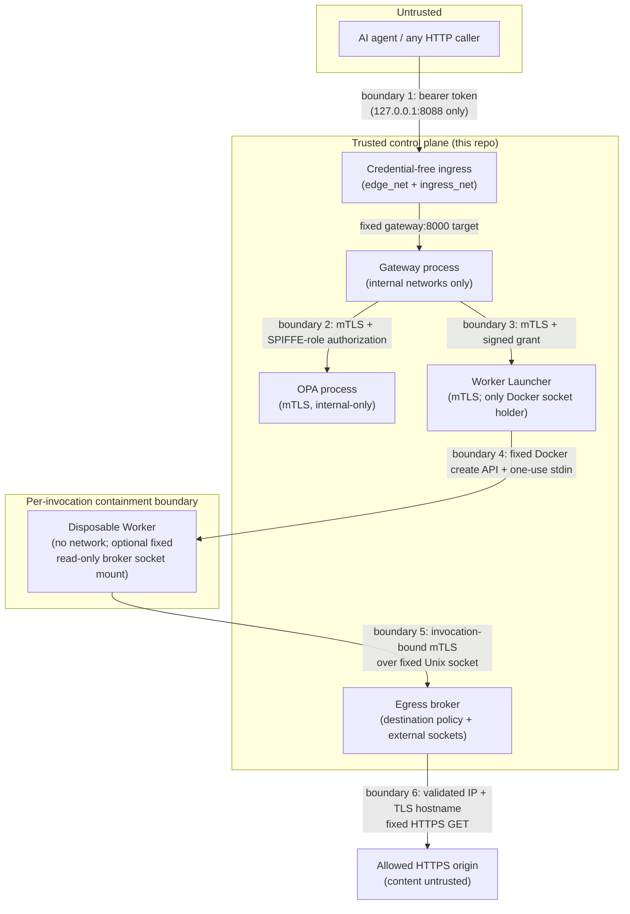

# Threat Model

## Scope

This threat model covers the vertical slice implemented in this repo: the
`POST /v1/tool-invocations` and `POST /v1/approvals` endpoints, delegated-
identity verification, the fixed tool registry, OPA-based authorization,
the approval store, signed execution protocol, Worker Launcher, disposable
Docker Workers, controlled egress broker, real read-only `web.fetch_text` tool,
development workload authentication, and audit trail. It does
**not** cover an LLM,
because there isn't one yet; see [Roadmap](../README.md#roadmap).

## Trust boundaries

- **Boundary 1 (Agent → Gateway):** the only boundary a real attacker
  crosses in this slice. Everything the gateway does to a request
  (signature verification, schema validation, registry lookup) exists
  because nothing arriving here is trusted by default. The gateway's
  published port is bound to `127.0.0.1` only (see `docker-compose.yml`),
  so this boundary is only reachable from the host itself in the local
  demo topology, not from the network.
- **Boundary 2 (Gateway → OPA):** TLS encrypts the channel and both peers
  authenticate with locally generated workload certificates. OPA authorizes
  the exact Gateway SPIFFE URI before allowing its narrow decision query.
  Missing and wrong-role certificates are rejected in live tests.
- **Boundary 3 (Gateway → Launcher):** mTLS authenticates the transport and a
  short-lived RSA-signed `ExecutionGrant` authenticates and binds the action.
  The Launcher's closed API has no runtime-control fields.
- **Boundary 4 (Launcher → Worker):** the Launcher alone has Docker authority.
  It selects a registry artifact and immutable image ID, creates a fresh
  hardened container, and sends one bounded record through stdin. The Worker
  has no Docker network, Docker SDK/socket, host path, or persistent state and
  signs its result with a per-run key. A web invocation receives only the fixed
  broker-socket named volume.
- **Boundary 5 (Worker → broker):** TLS is carried over the Unix socket and
  requires a short-lived client certificate whose sole URI SAN binds the exact
  invocation and Worker IDs. The broker independently verifies that identity,
  the signed grant, its expiry/replay state, tool/artifact/argument bindings,
  destination authority, and fixed limits before DNS.
- **Boundary 6 (broker → origin):** the broker owns DNS, TCP, TLS, HTTP parsing,
  redirect handling, and response bounds. Origin content is explicitly
  untrusted even when transport and destination checks succeed.

Everything inside "Trusted compute" is code and configuration this repo
controls and can reason about statically. Nothing outside it is trusted,
including the token's own claims prior to verification, and, as of the
OPA-owns-the-policy-mapping correction, including anything the gateway
itself might claim about a tool's required scope or risk when talking to
OPA (OPA never reads those fields from gateway input at all; see
[Who owns the policy mapping](architecture.md#who-owns-the-policy-mapping)).

## Assets

| Asset | Why it matters |
|---|---|
| Delegated-identity signing key (private) | Compromise lets an attacker impersonate any agent/user pair with any scopes. Never present in the gateway process; only the public key is. |
| Execution-grant workload key (private) | Compromise lets an attacker mint Launcher-accepted grants until key rotation or grant expiry. Present only in the Gateway. |
| Development workload CA keys | Compromise permits impersonating an internal service in the local prototype. Generated locally, gitignored, and not production PKI. |
| Per-invocation Worker credential / Worker client CA | Permits access to the broker socket, but only with a matching unexpired signed grant. The CA key is held by the trusted Launcher in this prototype. |
| Destination policy and egress audit chain | Determines which public HTTPS origins and resolved addresses can receive connections and supplies evidence for every redirect hop. |
| Launcher Docker authority | Compromise can create arbitrary containers and may amount to host compromise. Only the narrow Launcher has this authority. |
| Approval records | Authorize a high-risk, otherwise-blocked action. Must be unforgeable and single-use. |
| Audit trail | The only record of who did what. Must be complete and must not itself become a data leak. |
| Mock tool "data" (fixed in-memory documents/tickets) | Low value by design: these are inert fixtures, not real systems. |

## Threats and mitigations

Organized by STRIDE. Each row names the concrete control and, where
relevant, the test that exercises it.

### Spoofing

| Threat | Mitigation |
|---|---|
| Attacker presents a forged or algorithm-confused token to impersonate an agent | RS256-only algorithm allow-list at `jwt.decode` time; PyJWT never lets the token's header choose the verification algorithm. `test_algorithm_confusion_none_rejected`, `test_algorithm_confusion_hs256_with_public_key_rejected`, `test_invalid_signature_rejected`. |
| Attacker replays a token issued for a different service | Audience is verified against a fixed, server-configured value. `test_wrong_audience_rejected`. |
| Attacker uses a token from an unrelated issuer | Issuer is verified against a fixed, server-configured value. `test_wrong_issuer_rejected`. |
| Attacker probes which specific check rejected a token (issuer vs. audience vs. signature) to map the verifier | The HTTP API returns a single generic `401` for every token failure mode; the specific reason is only ever logged server-side (`src/gateway/api/deps.py`). Precise failure modes are tested directly against the verifier function (`tests/test_token_verification.py`), not through the HTTP surface, so the oracle is never exposed. |
| A token issuer sets `sub` to one value and `agent_id` to another, letting a token assert one authenticated subject while the gateway acts under a different agent identity | `verify_delegated_token` requires `sub == agent_id` and rejects the token outright (`TokenSubjectMismatch`) if they differ. `test_sub_agent_id_mismatch_rejected`. |

### Tampering

| Threat | Mitigation |
|---|---|
| Client adds an unexpected field to smuggle extra behavior (e.g. a `risk` override) | Every request/argument schema uses `extra="forbid"`; unknown fields are a hard `422`, not silently dropped. `test_client_supplied_risk_override_rejected`, `test_unexpected_argument_rejected`. |
| Client names an arbitrary Python function/module as the "tool" | Tool names only ever index a fixed, hardcoded `dict` (`TOOL_REGISTRY`). No `getattr`, no `importlib`, no `eval`. `test_unknown_tool_rejected`. |
| Client tampers with an approval's bound arguments (asks for approval on X, executes Y) | Approval records store a hash of the exact validated arguments; consumption re-hashes the current request's arguments and requires an exact match. `test_approval_for_different_arguments_denied`. |
| Client reuses one identity's approval under another identity | Approval records are bound to `(agent_id, delegated_user_id)`; mismatch is rejected. `test_approval_for_different_identity_denied`. |
| Grant or result fields are changed after authorization | Closed envelopes commit canonical arguments/actions/results; RSA signatures and exact invocation/tool/artifact/approval binding are rechecked at each boundary. `tests/test_execution_protocol.py`. |
| Caller supplies an image, command, mount, capability, network, or host path | The Launcher's only request field is `grant`; all runtime configuration comes from its own registry and fixed create call. `tests/test_launcher.py::test_launcher_api_rejects_every_caller_runtime_control`. |
| Caller or Worker changes the HTTP method, URL, headers, credentials, or limits after authorization | The broker request has only `{protocol_version, operation, worker_id, grant}`. The URL and limits exist only in the signed grant, and the operation literal is fixed to `https_get_text`. Unknown fields are rejected. |
| URL parsing differences enable scheme, user-info, port, trailing-dot, IDNA, encoded-IP, or hostname confusion | One canonical parser runs before signing and again at every broker hop. It rejects ambiguous forms and normalizes case, trailing dots, IDNA, and percent escapes. `tests/test_egress.py`. |

### Repudiation

| Threat | Mitigation |
|---|---|
| No record exists of a denied or allowed high-risk attempt | Every code path (success, every denial branch, every error branch) emits exactly one `AuditEvent` before returning. `test_audit_entry_for_denial_is_distinguishable_from_allow`. |
| Audit trail doesn't distinguish "denied" from "allowed" clearly enough to matter | `outcome`, `policy_decision`, `scope_decision`, and `approval_state` are all recorded per event and are independently inspectable. |
| No record exists of an approval being created, rejected at creation, consumed, or hitting a binding failure (including replay) | A separate `ApprovalAuditEvent` schema covers exactly these four events (`created`, `rejected`, `consumed`, `binding_failed`), emitted at every corresponding code path in `POST /v1/approvals` and `POST /v1/tool-invocations`. `test_approval_creation_audited_and_redacted`, `test_approval_rejection_audited`, `test_approval_consumption_audited`, `test_approval_replay_binding_failure_audited`. |

### Information Disclosure

| Threat | Mitigation |
|---|---|
| Audit log leaks raw tool arguments (which may contain sensitive user data) | `AuditEvent` and `ApprovalAuditEvent` (both `extra="forbid"`) have no field for raw arguments or raw results; only `argument_hash` / `result_hash` (SHA-256 of canonical JSON). It is structurally impossible to attach a raw value. `test_audit_redacts_raw_arguments`. |
| Audit log leaks the approval id or the approver credential | Neither `AuditEvent` nor `ApprovalAuditEvent` has a field for either; the schema has no place to put them, by design (see the [approval provenance correction](architecture.md#two-phase-approval-flow)). `test_approval_creation_audited_and_redacted`, `test_approval_consumption_audited`, `test_approval_replay_binding_failure_audited` all assert the id and, where applicable, the `X-Approver-Key` value are absent from the captured log text, not just absent from one field. |
| A tool handler's exception message (which might contain internal details) reaches the client | All handler exceptions are caught, logged server-side only, and converted to a generic `tool_execution_failed` response. `test_mock_tool_exception_fails_safely`, `test_unexpected_tool_exception_fails_safely`. |
| Bearer token or signing material ends up in logs | Only the verified `AgentIdentity` (not the raw token) is ever passed downstream from `get_verified_identity`. The raw token string never reaches `emit_audit_event` or any logger call. |
| Egress audit leaks fetched content, credentials, or raw URLs | The closed hop schema records destination/address hashes, an allowlisted origin, decision/reason, and timing only. It has no field for body bytes, grant, certificate, key, cookie, or authorization header. |

### Denial of Service

The public API still has no rate limiting. Egress-specific resource exposure is
bounded by a 2 KiB URL limit, five-second total deadline, three redirects,
64 KiB response, identity content encoding, bounded protocol records, and
Worker CPU/memory/PID/output/lifetime limits. Broker-service saturation and
distributed denial of service remain out of scope.

### Elevation of Privilege

| Threat | Mitigation |
|---|---|
| Agent requests a tool for which its delegated scopes don't qualify | OPA denies whenever the tool's `required_scope` (resolved from OPA's own `tools` data, never gateway input) isn't in `scopes`, checked before anything else. `test_missing_delegated_scope_denied`, `test_scope_escalation_attempt_denied`, `policy/gateway/authz_test.rego::test_deny_on_scope_escalation_attempt`. |
| A compromised or buggy gateway sends a weaker `required_scope`/`risk` to make OPA under-authorize a request | OPA's decision logic never reads a `required_scope` or `risk` field from its input at all; it resolves both itself from `tools[input.tool]`. `policy/gateway/authz_test.rego::test_ignores_spoofed_required_scope_and_risk`, `tests/test_approvals.py::test_fake_policy_client_ignores_spoofed_scope_metadata`, `scripts/verify_opa_hardening.py` (against a live OPA). |
| OPA's policy data drifts out of sync with the gateway's own tool registry (e.g. a deploy updates one but not the other), silently changing what's enforced | The gateway cross-checks OPA's `required_scope`/`risk`/`approval_required` metadata against its own registry on every decision and fails closed (`503 policy_registry_mismatch`) on any mismatch, regardless of what `decision` says. `test_registry_policy_mismatch_fails_closed`. |
| Agent invokes a high-risk tool without approval | `approval_state == "none"` maps to `approval-required`, never `allow`. `test_approval_required_when_none_supplied`. |
| Agent replays a spent approval to execute a second time | Approval consumption is atomic (single lock-guarded check-and-set) and happens exactly once, immediately before execution; a second consumption attempt on the same record returns `already_used`. `test_approval_replay_denied`, `test_approval_race_only_one_consumer_wins`. |
| Two requests race to use the same approval | `consume()` is called under a single lock as the last step before execution; only one of any number of concurrent callers can win. `test_approval_race_only_one_consumer_wins`, `test_consume_race_lost_denies_at_api_level`. |
| An approval is consumed prematurely by a policy denial or outage, stranding a legitimate approval as spent | Two-phase design: `validate()` (non-consuming) informs the OPA call; `consume()` (atomic, mutating) runs only after OPA answers `allow`. `test_approval_survives_policy_outage`, `test_approval_survives_policy_denial`. |
| An approval expires in the gap between validation and the final atomic consume | `consume()` re-checks expiration itself under the same lock; a since-expired approval fails closed even if `validate()` saw it as valid moments earlier. `test_approval_expiring_between_validate_and_consume_fails_closed`. |
| Policy engine becomes unreachable and the gateway defaults to allow | Every `PolicyError` is caught and converted to a `503`; there is no code path that treats a policy failure as `allow`. `test_policy_service_failure_fails_closed`. |
| Policy answers with malformed, incomplete, or unexpected-shaped data (missing field, unknown field, empty version, unknown decision string) | `PolicyDecision` is a closed Pydantic schema (`extra="forbid"`); any deviation raises `PolicyError`, treated identically to an outage: `503`, fail closed. |
| Approval-creation endpoint is called by the requesting agent itself (self-approval) | `POST /v1/approvals` requires a separate `X-Approver-Key` credential, distinct from any agent's delegated-identity token. This is a simplification; see Known limitations. |
| Client sets its own approver identity on a grant (`granted_by`) to fabricate provenance | The request schema has no `granted_by` field at all (`extra="forbid"` rejects one if sent); the approver identity recorded is always `Settings.approver_identity`, from trusted server configuration. `test_create_approval_ignores_client_supplied_granted_by`. |
| A valid grant is replayed or raced concurrently | The Launcher atomically claims its signed nonce before container creation; one process has one winner. `test_one_grant_has_exactly_one_concurrent_winner`. |
| A Worker reaches the network, host, Docker socket, or prior invocation state | Every invocation is a new `--network none`, non-root, read-only container with no caller/host-path mounts, a bounded tmpfs, dropped capabilities, no-new-privileges, and quotas. A web invocation receives only the fixed broker-socket volume. `scripts/verify_worker_hardening.py` exercises live network and cross-run-state controls. |
| Worker bypasses the broker to reach an origin directly | Every Worker remains `network_disabled=True`; a web Worker gets only the fixed read-only Unix-socket volume. The broker—not the Worker—owns DNS/TCP/TLS. Unit tests inspect the exact Docker create options and the live hardening script probes a direct IP connection. |
| SSRF reaches loopback, RFC/private, link-local, multicast, metadata, reserved, or non-global IPv4/IPv6 | The broker validates every answer at connection time and rejects the entire set before its connector is called. IPv4-mapped IPv6 and explicit metadata addresses are normalized/blocked. Parameterized tests assert zero connector calls. |
| An allowlisted hostname resolves to a deployment-local address that is globally classified | The broker also rejects every address in its server-owned IPv4/IPv6 denied-CIDR set. The Compose protected subnet is separate from the allowed fixture subnet and is denied after DNS but before connection; the protected listener observes zero connections. |
| DNS rebinding changes the address after policy validation | There is no policy-time/connection-time second lookup: the broker resolves once immediately before connection, validates every answer, and passes the selected numeric socket address to the connector while retaining the original hostname only for TLS verification. |
| An allowed URL redirects to a blocked target or loops indefinitely | Every `Location` begins a fresh canonicalization/origin/DNS/address/TLS decision. Blocked redirect targets observe zero connections; loops and more than three redirects are denied. |
| Worker calls the broker with no, unknown, expired, wrong-role, or other-invocation credentials | TLS and certificate-profile checks run before grant/DNS processing. The exact certificate SAN must bind the request's Worker ID and signed action invocation. All negative credential cases assert zero resolver and connector calls. |
| Oversized, slow, compressed, non-UTF-8, or disallowed-content response consumes unbounded resources | The raw connector enforces content length, streamed byte cap, identity encoding, and remaining total deadline; the broker independently checks bytes, media type, charset, and strict UTF-8. |

## Security assumptions

- **The Gateway never holds the delegated-identity issuer's private signing
  key.** It only holds the public key used to *verify* tokens; tokens are minted by an external,
  trusted identity issuer not implemented in this repo.
- **The Gateway does hold a dedicated development execution-grant private
  key.** Compromise permits grants until that local key is rotated; the key is
  never placed in the Worker or Launcher.
- **Development credentials are mounted by role, not by directory.** The
  Gateway alone receives the execution-grant signer and the Launcher alone
  receives the Worker CA key. OPA, broker, and both fixtures receive only their
  own identity and required public trust material. The ingress receives none.
- **`sub == agent_id` for every issued token.** The identity model treats
  these as the same value; an issuer minting tokens where they differ
  will have every such token rejected (`TokenSubjectMismatch`). See
  `docs/architecture.md#identity-model`.
- **Only RS256-signed tokens are ever accepted**, enforced at process
  startup (`load_settings()` fails closed on any other `JWT_ALGORITHM`),
  not just at request-verification time.
- **OPA's Rego data (`tools`) and the gateway's Python registry
  (`TOOL_REGISTRY`) are two independently-maintained sources of truth**
  that are expected to agree; the gateway cross-checks this on every
  request and fails closed on disagreement rather than assuming it can
  never happen. See `docs/architecture.md#why-a-compromised-gateway-cant-weaken-policy`.
- The OPA instance has no published port at all and sits on a Docker
  `internal: true` network alongside the gateway, verified empirically
  (a throwaway container attached only to that network could not resolve
  DNS or reach `example.com`; see `docs/architecture.md#docker-network-topology`)
  rather than merely configured and assumed correct. It is reachable only
  from the gateway container, over that network, and OPA's own
  `--authorization=basic` policy further restricts its HTTP API to
  exactly the gateway's decision query and a liveness check.
- The Gateway is attached only to `internal: true` control and ingress
  networks. A separate credential-free fixed-target ingress owns the host port
  and normal bridge attachment; it has no access to OPA, Launcher, broker,
  fixtures, credentials, or Docker.
- **The egress broker is trusted enforcement code.** In Compose it is the only
  enforcement component attached to the allowed and protected fixture
  networks. The protected subnet is explicitly denied. The Worker has no IP
  route to the broker or either origin and can reach only the broker's Unix
  socket.
- **The configured allowlist is maintained server-side.** The agent selects a
  URL inside the `web.fetch_text` schema, but it cannot add an origin to the
  signed or broker policy. A permitted service can still proxy or change its
  content.
- The host running the approval store is trusted to keep it in-memory
  and process-local; this is explicitly not a durability guarantee (see
  Known limitations).
- Clock skew between the gateway and whatever issues delegated tokens is
  small enough that PyJWT's default `exp`/`iat` handling is sufficient
  (no explicit `leeway` is configured).

## Known limitations

These are deliberate scope cuts for a vertical slice, not oversights.
Each is a candidate for the roadmap.

- **Approval store is in-memory and single-process.** It does not survive
  a restart and does not work across multiple gateway replicas. A
  production deployment needs a persistent store with the same atomic
  check-and-set guarantee (e.g., a unique DB constraint or a Redis
  compare-and-set).
- **Approver authentication is a static shared secret.** `X-Approver-Key`
  is a placeholder for a real approver identity system (human-in-the-loop
  UI, its own delegated-identity flow, or an approval workflow engine).
- **No rate limiting or request-size ceiling beyond field-level
  constraints.** A malicious or buggy caller can send unbounded request
  volume; nothing in this slice throttles it.
- **Development workload identity is not production PKI.** Local CAs and
  short-lived fixture certificates provide mTLS and role-negative tests, but
  there is no automated enrollment, rotation, revocation, or hardware-backed
  key protection.
- **Allowed content is not trustworthy.** Destination and TLS controls do not
  prevent prompt injection, malicious markup, or a permitted service acting as
  a proxy. Milestone 5's hostile-output boundary is not implemented; callers
  must treat `web.fetch_text` output as untrusted data.
- **The broker and parsers are trusted and attackable.** TLS/HTTP/DNS parser
  defects, IP/IDNA classification drift, broker traffic analysis, and broker
  denial of service remain possible. The broker has process-local replay state,
  not durable distributed state.
- **The Launcher holds the Worker client-CA private key in this prototype** to
  issue per-invocation credentials. Production enrollment, revocation, key
  protection, and multi-host issuance are not implemented.
- **The credential-free ingress retains normal bridge-network exposure.** It
  exists because Docker Desktop did not provide host-published ingress for a
  service attached only to an `internal: true` network. Its fixed proxy code
  targets only `gateway:8000`, and network segmentation prevents it from
  reaching OPA, Launcher, broker, or fixtures, but compromise of this minimal
  process could still use its ordinary bridge route for denial of service or
  unrelated outbound traffic. It holds no credentials or execution authority.
- **OPA's read-only API hardening (`--authorization=basic`) governs the
  HTTP management API only.** It does not prevent someone with access to
  the host or the Compose file from editing the mounted policy files
  directly and redeploying; that's a host/deployment-security concern
  outside this slice's scope, not something an in-band API control can
  address.
- **JWT revocation is not implemented.** A verified, unexpired token is
  honored for its full lifetime; there is no denylist or short-lived-token
  rotation strategy in this slice (tokens are expected to be short-lived
  by convention, not enforced by the gateway).
- **Docker and Launcher remain high-value trust assumptions.** Docker shares
  the host kernel and is not equivalent to gVisor or a microVM. The Launcher
  has the Docker socket; its compromise can plausibly compromise the host.
  Workers use Docker's default seccomp profile rather than a
  Worker-specific minimized profile.
- **Replay protection is process-local.** A Launcher restart forgets claimed
  nonces. Short grant lifetimes reduce but do not eliminate the resulting
  replay window; distributed durable nonce storage is not implemented.
- **No defense against a compromised or malicious tool's *output*.** This
  slice only defends the invocation path; nothing here evaluates whether
  a tool's returned data is safe to hand back to an agent/LLM. See
  Roadmap.
